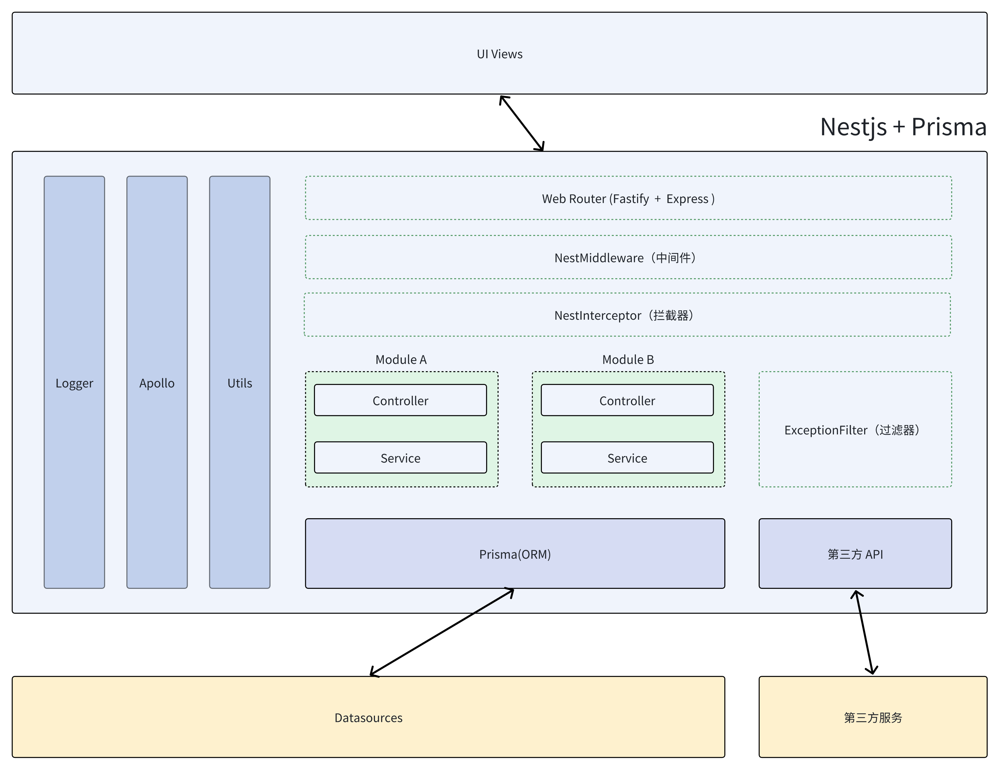

## 开箱即用的nest服务端应用脚手架

## 架构



## 技术栈

nestjs + typescript + pnpm + apollo + docker + winston + prisma + mongodb + mysql + elasticsearch + kafka + redis

版本管理工具：volta

## 功能列表

- ✅ jwt 登录鉴权
- ✅ swagger api在线文档
- ✅ apollo 配置管理中心
- ✅ 多数据源（MySQL、MongoDB、ES、Kafka、Redis）、持久层框架ORM（prisma）
- ✅ 基建完善（代码规范、代码风格、文件命名、提交规范、cicd、拦截器、过滤器、中间件、守卫、统一出参）
- ✅ 日志跟踪（winston）
- ✅ gitlab cicd
- ✅ 支持容器化部署（docker）
- ✅ 内置爬虫功能
- ✅ 内置飞书告警
- ✅ 内置图片合成功能
- ✅ 支持静态资源服务器
- ✅ 支持多环境区分
- ✅ 支持服务健康检查
- ✅ 支持自定义调度器
- ⬜ 集成GraphQL

## 项目启动

```bash
$ pnpm install
```

## 快速上手

```bash
# development
$ pnpm run start

# watch mode
$ pnpm run start:dev

# production mode
$ pnpm run start:prod
```

## 测试

```bash
# unit tests
$ pnpm run test

# e2e tests
$ pnpm run test:e2e

# test coverage
$ pnpm run test:cov
```

## 基建

pnpm install -D @commitlint/cli @commitlint/config-angular @commitlint/config-conventional

pnpm install -D @ls-lint/ls-lint

pnpm install -D eslint prettier husky lint-staged

## 日志

pnpm install nest-winston winston winston-daily-rotate-file

日志按日分割

## 对外API

pnpm install swagger-ui-express @nestjs/swagger

## Apollo

**开源配置管理中心，用于统一管理配置信息，并支持实时更新配置**

[apollo统一配置管理中心](https://github.com/apolloconfig/apollo/wiki/Apollo%E9%85%8D%E7%BD%AE%E4%B8%AD%E5%BF%83%E4%BB%8B%E7%BB%8D)

**具体使用查看datasources/appollo**

## jwt

pnpm install @nestjs/jwt @nestjs/passport passport passport-jwt

## prisma

pnpm install @nestjs/prisma prisma @prisma/client

[prisma官网](https://www.prisma.io/docs/getting-started)

Prisma目前支持的数据库有：PostgreSQL、MySQL、SQLServer、SQLite、MongoDB、CockroachDB、PlanetScale、MariaDB

**Monogodb采用原生的连接方式，不使用prisma。具体使用查看datasources/mongodb**

**prisma连接的数据库账号密码，不能带有@符号**

```js

// 初始化(生成prisma模型定义文件，数据库连接驱动)
npx prisma init

// 迁移数据库 将定义的数据模型迁到数据库中 (以下命令仅适用于关系型数据库mysql等)
pnpm run db:migrate or npx prisma migrate dev --name init

// 生成客户端
pnpm run db:generate or npx prisma generate

// 连接数据库客户端执行数据初始化
pnpm run db:seed

```

## 数据库支持

MySQL、Mongodb、ES、Kafka、Redis

客户端：

navicat(MySQL、Mongodb)

kibana(ES)

Offset Explorer(Kafka)

RedisDesktopManager(Redis)
